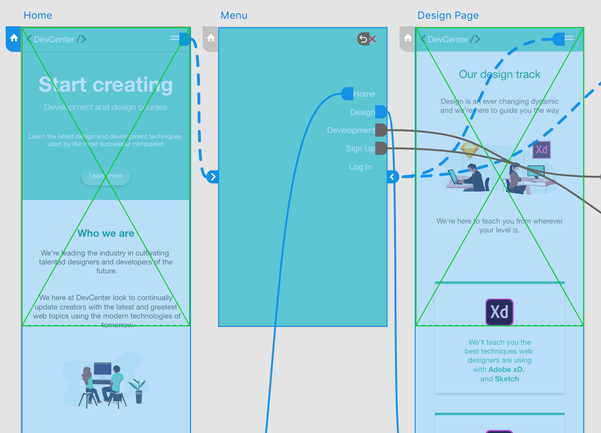
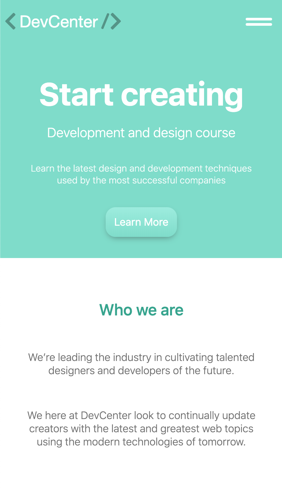

# DevCenter
ui/ux + front-end project

Tools / Process:

- Designed using Adobe XD & Photoshop
- Converted design files into HTML / CSS / JS
- Webpack / Npm custom configuration
- SASS / SCSS
- Autoprefixing and minification of stylesheets
- JavaScript minification

Prototyping | Mobile Homepage
:-------------------------:|:-------------------------:
 |  

